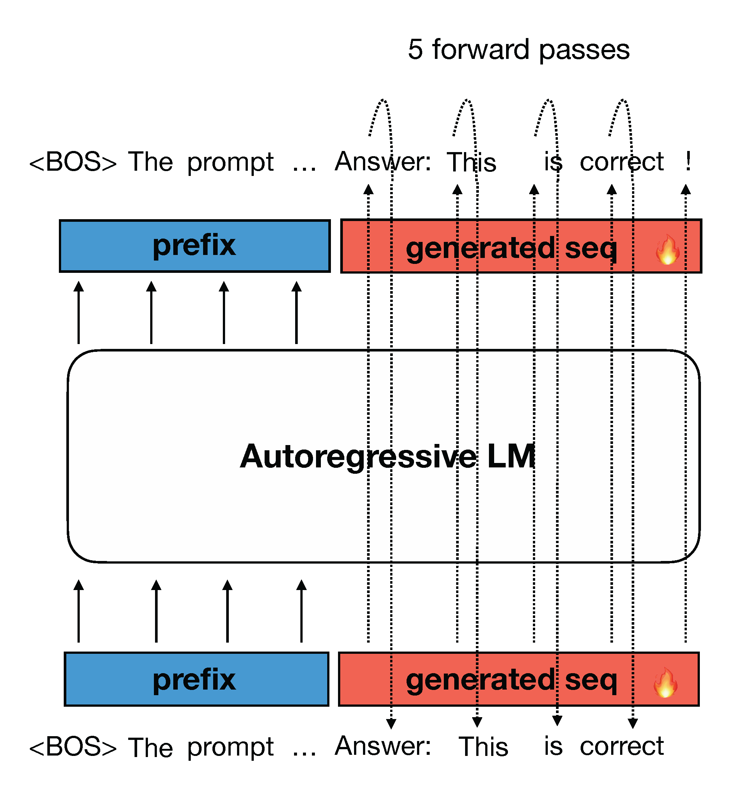
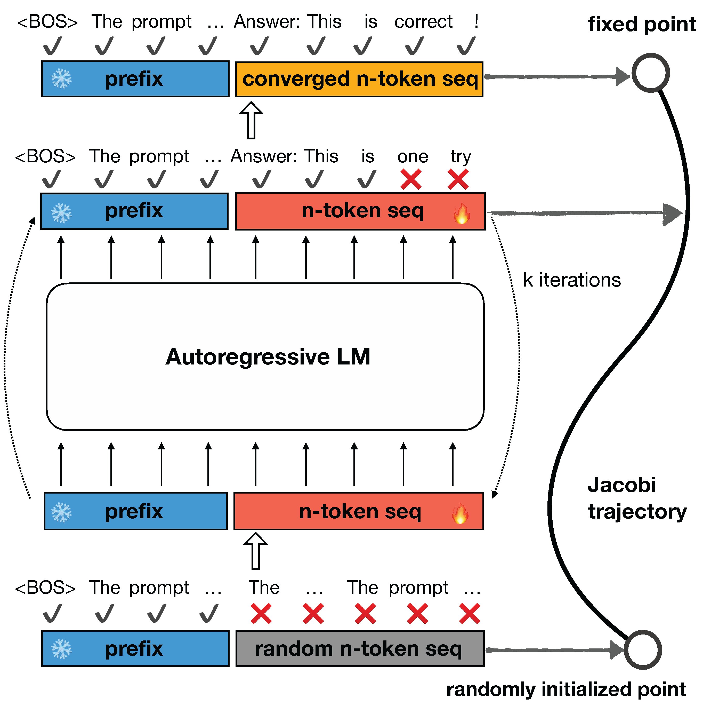

# Accelerate LLM Inference with CLLMs

**TL;DR:** In this article, we introduce consistency large language models (CLLMs), a new family models developed with our proposed techniques to reduce inference latency by efficiently decoding $n$ tokens in parallel. This decoding method is called [Jacobi decoding](https://arxiv.org/abs/2305.10427), which improve inference efficiency by breaking the seuqntially nature of convential auto-regressive (AR) decoding. CLLMs are trained with the objective of efficiently mapping any randomly initialized $n $-token sequence to a correctly predicted sequence in as few steps as possible. Experiment results show CLLMs obtained with our proposed method are highly effective, showing $1.3\times$ to $3.4\times$ improvements in generation speed while preserving generation quality in comparison with the baselines and other SOTA techniques. CLLMs also show a high adaptability and memory efficiency as they require no modifications to the existing model architecture and auxiliary model components.

## Background: Jacobi Decoding

Large language models (LLMs) are transforming the landscape of human lives, From programming to offering legal and health advice. However, during inference, LLMs generate responses token by token using AR decoding as shown in Figure 1, leading to high latency for longer responses. Using AR decoding, it often necessiate architectural modifications, auxiliary components, or draft models, to speedup inference by generating more than one token at a time. 

Figure 1: illustration of conventional AR decoding: one token is generated at a time.

[Jacobi decoding](https://arxiv.org/abs/2305.10427) originiates from the Jacobi and Gauss-Seidel fixed-point iteration for solving nonlinear equations, and is proven to be identical to AR generation using greedy decoding [[1]](https://proceedings.mlr.press/v139/song21a.html). reformulates the sequential generation process into a problem of solving a system of $n$ non-linear equations with $n$ variables. However, Jacobi decoding seldom accurately predicts more than one token in a single fixed-point iteration step.

Figure 2: illustration of Jacobi decoding: n-token sequence is fed into the LLM and iterates until convergence.

### Jacobi Trajectory

The Jacobi decoding method for LLMs first randomly by guesses the next n tokens in a sequence (referred to as n-token sequence hereinafter unless
speficied otherwise) from an input prompt. The n-token sequence, along with the prompt, is then fed to the LLM to iteratively update itself. This process continues until the n-token sequence stabilizes and no further changes occur, reaching a fixed point. Notably, Jacobi decoding does not require more queries to the LLM than auto-regressive (AR) decoding. Eventually, the n-token sequence converges to the output that would be generated by AR decoding under a greedy strategy. This progression from an initial random guess to the final AR generation outcome traces what is known as a Jacobi trajectory. An instance of Jacobi decoding iteration process and instance **Jacobi trajecotry** is illustrated in Figure 2.

### Limitations of Jacobi Decoding

Vanilla Jacobi decoding for LLMs shows only marginal speedup over AR decoding in practice, e.g., an average of $1.05\times$ speedup [[2]](https://arxiv.org/abs/2305.10427). This is because an AR-trained LLM can rarely yield a correct token when there are incorrection in its preceding tokens (By correctness, we mean alignment with the AR generation). Thereby, most Jacobi iterations gain only one correction for the $n$-token sequence, resulting in a longer trajectory as illustrated on the left side of Figure 3.

## Consistency LLMs (CLLMs)

### Jacobi Decoding Preliminary

Given a prompt $\mathbf x$ and a pre-trained LLM $p(\cdot| \mathbf x)$, we obtain the model generation typically with the standard AR decoding method under the greedy strategy, i.e.

$$
\begin{align}
y_i = \underset{y}{\text{arg max }} p(y | \mathbf {y}_{:i}, \mathbf x) \ \ \text{for}\,\, i = 1,\dots,n
\end{align}
$$

Jacobi decoding re-frames the LLM inference process as solving a system of nonlinear equations to transform the decoding process into a parallelizable computation. Consider, $f(y_i, \mathbf y_{:i}, \mathbf x):= y_i- \underset{y}{\text{arg max }} p(y | \mathbf y_{:i}, \mathbf x)$, we can rewrite the above equation as a system of nonlinear equations:

$$
\begin{align}
f(y_i, \mathbf y_{:i}, \mathbf x) = 0 \ \ \text{for}\,\, i = 1,\dots,n 
\Longrightarrow 
\begin{cases}
y_{1}^{(j+1)} &= \underset{y}{\text{arg max}} \ \ p(y | \mathbf x) \\
y_{2}^{(j+1)} &= \underset{y}{\text{arg max}} \ \ p(y | \\mathbf y_{1}^{(j)}, \mathbf x) \\
& \vdots \\
y_{n}^{(j+1)} &= \underset{y}{\text{arg max}} \ \ p(y | \\mathbf y_{:n}^{(j)}, \mathbf x)
\end{cases}
\end{align}
$$

Note that The iteration exits at some k such that $\mathbf y^{(k)} = \mathbf y^{(k−1)}$ and we define $\mathbf y^{∗} := \mathbf y^{(k)}$ as the fixed point, and $\mathcal J := \set{  \mathbf y^{(1)}, \dots, \mathbf y^{(k)} }$ as the Jacobi trajectory. 

### Training with Jacobian Trajectories

To address this, we propose adapting pre-trained LLMs so that they can consistently mapp any point $\mathbf y$ on the Jacobi trajectory $\mathcal{J}$ to the fixed point $\mathbf y^*$. Surprisingly, we find such an objective is analogous to that of [consistency models](https://arxiv.org/abs/2303.01469), a leading acceleration approach for diffusion models [3, 4]. In our proposed method, we use Jacobi trajectories collected from a target model to train the model with a loss that encourages single-step convergence during Jacobi iterations. For each target model $p$ to be adapted as a CLLM, the training consists of two parts:

- **Jacobi trajectory preparation:** for each prompt, we sequentially perform Jacobi decoding for every truncation of $n$ tokens until the entire response sequence $\mathbf \ell$ has been generated, which amounts to a concatenation of all consecutive fixed points. Note that for a lengthy response $\ell$ of $N$ ($N ≫ n$) tokens, this approach avoids slow model evaluation on lengthy input. 

- **Training with consistency and AR loss:** we jointly optimize two losses for tuning CLLMs, the consistency loss guarantees the prediction of multiple tokens at once and the AR loss prevents the CLLM from deviating from the target LLM so as to maintain generation quality.

### Consistency and AR Loss

##  Experiments

### Results

### Fast Forwarding and Stationary Tokens

## Final words
We invite you to refer to the [our paper](TODO) for more details! Please stay tuned for code and CLLM checkpoint release!

## References
[1] Song, Yang, et al. "Accelerating feedforward computation via parallel nonlinear equation solving." International Conference on Machine Learning. PMLR, 2021.

[2] Santilli, Andrea, et al. "Accelerating Transformer Inference for Translation via Parallel Decoding." arXiv preprint arXiv:2305.10427 (2023).

[3] Song, Yang, and Prafulla Dhariwal. "Improved techniques for training consistency models." arXiv preprint arXiv:2310.14189 (2023).

[4] Song, Yang, et al. "Score-based generative modeling through stochastic differential equations." arXiv preprint arXiv:2011.13456 (2020).
