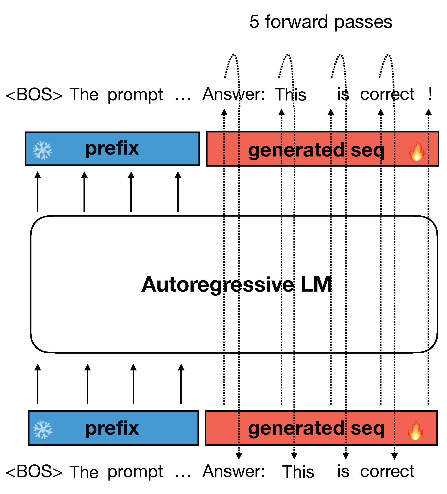
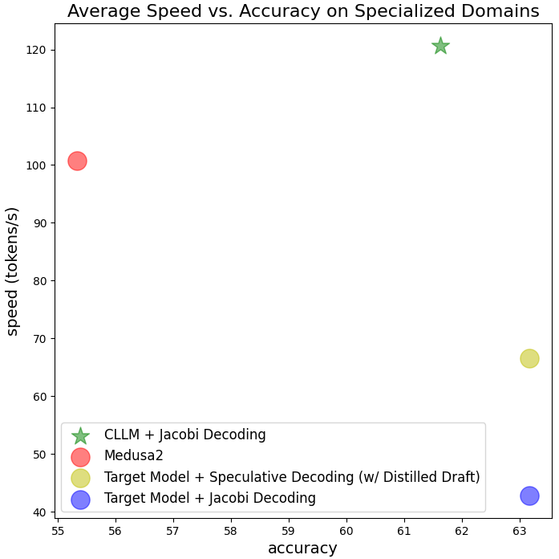

# Accelerate LLM Inference with CLLMs

**TL;DR:** In this article, we introduce consistency large language models (CLLMs), a new family models developed with our proposed techniques to reduce inference latency by efficiently decoding $n$ tokens in parallel. This decoding method is called [Jacobi decoding](https://arxiv.org/abs/2305.10427), which improve inference efficiency by breaking the seuqntially nature of convential auto-regressive (AR) decoding. CLLMs are trained with the objective of performing efficient Jacobi decoding by mapping any randomly initialized $n $-token sequence to a correctly predicted sequence in as few steps as possible. Experiment results show CLLMs obtained using our proposed method are highly effective, showing $1.3\times$ to $3.4\times$ improvements in generation speed while preserving generation quality in comparison with the baselines and other SOTA techniques. CLLMs also show a high adaptability and memory efficiency as they require no modifications to the existing model architecture and auxiliary model components.

## Background: Jacobi Decoding

Large language models (LLMs) are transforming the landscape of human lives, From programming to offering legal and health advice. However, during inference, LLMs generate responses token by token using AR decoding as shown in Figure 1, leading to high latency for longer responses. Using AR decoding, it often necessiate architectural modifications, auxiliary components, or draft models, to speedup inference by generating more than one token at a time. 

Figure 1: illustration of conventional AR decoding: one token is generated at a time.

[Jacobi decoding](https://arxiv.org/abs/2305.10427) originiates from the Jacobi and Gauss-Seidel fixed-point iteration for solving nonlinear equations, and is proven identical to AR generation using greedy decoding [[1]](https://proceedings.mlr.press/v139/song21a.html). Jacobi decoding reformulates the sequential generation process into a problem of solving a system of $n$ non-linear equations with $n$ variables. However, Jacobi decoding seldom accurately predicts more than one token in a single fixed-point iteration step.

Figure 2: illustration of Jacobi decoding: $n$-token sequence is fed into the LLM and iterates until convergence.

### Jacobi Trajectory

The Jacobi decoding method first randomly guesses the next $n$ tokens in a sequence (referred to as $n$-token sequence hereinafter unless speficied otherwise) from an input prompt. The $n$-token sequence, along with the prompt, is then fed to the LLM to iteratively update itself. This process continues until the $n$-token sequence stabilizes and no further changes occur, reaching a fixed point. Notably, Jacobi decoding does not require more queries to the LLM than auto-regressive (AR) decoding. Eventually, the $n$-token sequence converges to the output that would be generated by AR decoding under a greedy strategy. This progression from an initial random guess to the final AR generation outcome traces what is known as a Jacobi trajectory. An instance of Jacobi decoding iteration process and instance **Jacobi trajecotry** is illustrated in Figure 2.

### Limitations of Jacobi Decoding

Vanilla Jacobi decoding for LLMs shows only marginal speedup over AR decoding in practice, e.g., an average of $1.05\times$ speedup [[2]](https://arxiv.org/abs/2305.10427). This is because an AR-trained LLM can rarely yield a correct token when there are incorrection in its preceding tokens (By correctness, we mean alignment with the AR generation). Thereby, most Jacobi iterations gain only one correction for the $n$-token sequence, resulting in a longer trajectory as illustrated on the left side of Figure 6.

## Consistency LLMs (CLLMs)

### Jacobi Decoding Preliminary

Given a prompt $\mathbf x$ and a pre-trained LLM $p(\cdot| \mathbf x)$, LLM typically generates with the standard AR decoding method under the greedy strategy, i.e.

$$
\begin{align}
y_i = \underset{y}{\text{arg max }} p(y | \mathbf {y}_{:i}, \mathbf x) \ \ \text{for}\,\, i = 1,\dots,n
\end{align}
$$

Jacobi decoding re-frames the LLM inference process as solving a system of nonlinear equations to transform the decoding process into a parallelizable computation. Consider, $f(y_i, \mathbf y_{:i}, \mathbf x):= y_i- \underset{y}{\text{arg max }} p(y | \mathbf y_{:i}, \mathbf x)$, we can rewrite the above equation as a system of nonlinear equations:

$$
\begin{align}
f(y_i, \mathbf y_{:i}, \mathbf x) = 0 \ \ \text{for}\,\, i = 1,\dots,n 
\Longrightarrow 
\begin{cases}
y_{1}^{(j+1)} &= \underset{y}{\text{arg max}} \ \ p(y | \mathbf x) \\
y_{2}^{(j+1)} &= \underset{y}{\text{arg max}} \ \ p(y | \\mathbf y_{1}^{(j)}, \mathbf x) \\
& \vdots \\
y_{n}^{(j+1)} &= \underset{y}{\text{arg max}} \ \ p(y | \\mathbf y_{:n}^{(j)}, \mathbf x)
\end{cases}
\end{align}
$$

Note that The iteration exits at some k such that $\mathbf y^{(k)} = \mathbf y^{(k−1)}$ and we define $\mathbf y^{∗} := \mathbf y^{(k)}$ as the fixed point, and $\mathcal J := \set{  \mathbf y^{(1)}, \dots, \mathbf y^{(k)} }$ as the Jacobi trajectory. 

### Training with Jacobian Trajectories

To address this, we propose adapting pre-trained LLMs so that they can consistently map any point $\mathbf y$ on the Jacobi trajectory $\mathcal{J}$ to the fixed point $\mathbf y^*$. Surprisingly, we find such an objective is analogous to that of [consistency models](https://arxiv.org/abs/2303.01469), a leading acceleration approach for diffusion models [3, 4]. In our proposed method, we use Jacobi trajectories collected from a target model to train the model with a loss that encourages single-step convergence during Jacobi iterations. For each target model $p$ to be adapted as a CLLM, the training consists of two parts:

- **Jacobi trajectory preparation:** for each prompt, we sequentially perform Jacobi decoding for every truncation of $n$ tokens until the entire response sequence $\mathbf l$ has been generated, which amounts to a concatenation of all consecutive fixed points. Each sequence generated along a trajectory counts as one data entry. Note that for a lengthy response $\mathbf l$ of $N$ ($N ≫ n$) tokens, such truncation avoids slow model evaluation on lengthy input.

- **Training with consistency and AR loss:** we jointly optimize two losses for tuning CLLMs, the consistency loss guarantees the prediction of multiple tokens at once and the AR loss prevents the CLLM from deviating from the target LLM so as to maintain generation quality.

Figure 3: an animation of Jacobi decoding, and the CLLM training objective for one-step convergence.

### Consistency and AR Loss

#### Consistency Loss

Let $p$ denote the target LLM. Let $q_\theta(\cdot| \mathbf x)$ denote the CLLM with parameters $\theta$ initialized with those of $p$. For a prompt $\mathbf x$ and the corresponding Jacobi trajectory $\mathcal{J}$, let $\mathbf y$ and $\mathbf y^*$ denote a random state and the fixed point on the trajectory respectively. 

We can encourage CLLM to output $\mathbf y^*$ with $\mathbf y$ as the input by minimizing the following loss, termed as the global consistency (GS) loss:

$$
\begin{align}
   \mathcal L_{\text{GC}} =\underset{(\mathbf x, \mathcal{J}) \sim \mathcal{D}, \mathbf y \sim \mathcal{J}}{\mathbb E} \Big[ \sum_{i=1}^n  D( q_{\theta}(\cdot|\mathbf y_{:i}^{*}, \mathbf x))  || q_{\theta}(\cdot|\mathbf y_{:i}, \mathbf x)\Big] 
\end{align}
$$

where we abuse notations to represent uniform sampling from the dataset.  $D(\cdot||\cdot)$ denotes the distance between two distributions, choices are discussed in [[5]](https://arxiv.org/abs/2306.13649) and in this paper we primarily experiment with the forward KL. 

Alternatively, local consistency (LC) loss following the formulation in [3], where the adjacent states $(\mathbf y^{(j)}, \mathbf y^{(j+1)}$ in a Jacobi trajectory $\mathcal{J}$ are driven to yield the same outputs:

$$
\begin{align}
   \mathcal L_{\text{LC}} =\underset{(\mathbf x, \mathcal{J}) \sim \mathcal{D}, (\mathbf y^{(j)}, \mathbf y^{(j+1)} )\sim \mathcal{J}}{\mathbb E} \Big[ \sum_{i=1}^n  D( q_{\theta}(\cdot|\mathbf y_{:i}^{(j+1)}, \mathbf x)) || q_{\theta}(\cdot|\mathbf y_{:i}^{(j)}, \mathbf x) \Big] 
\end{align}
$$

#### AR Loss

To avoid deviating from the distribution of the target LLM, we incorporate the traditional AR loss based on the generation $\mathbf l$ of the target LLM $p$:

$$
\begin{align}
    \mathcal L_{\text{AR}} = \underset{ (\mathbf x, \mathbf l) \sim \mathcal D }{\mathbb E} \Big[ - \sum_{i=1}^N \log q_{\theta}(l_i | \mathbf l_{:i}, \mathbf x) \Big]
\end{align}
$$

Putting the two loss together, with some weight $w$, the total loss for training a CLLM is:

$$
\mathcal{L}(\theta) = \mathcal L_{\text{consistency}} + w\mathcal{L}_{\text{AR}}
$$

##  Experiments

### Results

Our experiments contains three domain-specific tasks, including Spider (text-to-SQL), Human-Eval (Python code completion) and GSM8k (math), and the broader open-domain conversational challenge, MT-bench. Reported experiments were conducted using either fine-tuned coder LLM, Deepseek-coder-7B-instruct [6] or LLaMA-2-7B [7] as the target model depending on the task. Both training and evaluation are carried out on NVIDIA A100 40GB servers.

Figure 4: CLLM speedup on different downstream tasks.

 

Figure 5: illustration of CLLM vs. other baselines on domain-specific tasks (Spider, CodeSearchNet-Python, GSM8k), as well as on MT-bench. Note that the dot size is in proportion to memory consumption.

**Specialized domains:** From Figure 5, we can see that in comparison with other baselines including the original target model, Medusa2, and speculative decoding, CLLMs achieve the most significant speedup.

**Open-domain conversatinoal Challenge (MT-bench):** CLLM trained from LLaMA2-7B using ShareGPT dataset can achieve roughly the same speedup as Medusa2 when combined with lookahead decoding, with comparable scores on MT-bench. However, CLLM offers higher adaptability and memory efficiency as it requires no modifications to the target model's original architecture and no auxiliary components.

### Fast Forwarding and Stationary Tokens

Figure 6: Comparison of Jacobi trajectory between a target LLM and CLLMs on Spider. Each point along the Jacobi trajectory is a color-coded sequence: blue for correct tokens matching with AR results, and red for inaccurate ones. CLLM demonstrates enhanced efficiency, converging to the fixed point $2\times$ faster the Target LLM. This increased efficiency in the CLLM can be attributed to the consistency loss which facilitates the learning of the strcture of each $n$-token sequence given a prefix.

The left side of Figure 6 shows target LLMs typically generate only one correct token in one iteration. In contrast, in CLLMs, we identify **fast forwarding phenomenon** where multiple consecutive tokens are correctly predicted in a single Jacobi iteration. 

Moreover, tokens correctly generated in advance (e.g. “country” and “H” at index 6 and 7 on the left side of Figure 6), are often replaced inaccurately in subsequent iterations in target LLMs. On the other hand, CLLMs exhibit the capability of predicting correct tokens preemptively, even with preceding incorrect tokens, while ensuring the tokens remain unchanged. We term such tokens as **stationary tokens**. Both phenomena contribute to the fast convergence in Jacobi decoding of CLLMs, thereby leading to a considerable generation speedup.

We observe that CLLMs acquire a crucial linguistic concept through training – **collocations**: a series of words or terms that co-occur more frequently than one would expect by random chance [[8]](https://aclanthology.org/P91-1036.pdf). Language is not solely composed of isolated words but also relies heavily on specific word pairings. Examples of collocations are abundant in both natural and coding languages. They include verb + preposition combinations (e.g., ''talk to'', ''remind ... of ...''), verb + noun structures (e.g., ''make a decision'', ''catch a cold''), and many more domain-specific syntactical structures (e.g., ''SELECT ... FROM ...'', ''if ... else'' for programming). The consistency generation objective allows CLLMs to infer such structures from any point in the Jacobi trajectory, encouraging CLLMs to acquire proficiency in numerous collocations and thereby predict multiple words simultaneously to minimize iteration steps. 

## Final words
We invite you to check out [our paper](TODO) for more details! Please stay tuned for code and CLLM checkpoint release!

## References
[1] Song, Yang, et al. "Accelerating feedforward computation via parallel nonlinear equation solving." International Conference on Machine Learning. PMLR, 2021.

[2] Santilli, Andrea, et al. "Accelerating Transformer Inference for Translation via Parallel Decoding." arXiv preprint arXiv:2305.10427 (2023).

[3] Song, Yang, and Prafulla Dhariwal. "Improved techniques for training consistency models." arXiv preprint arXiv:2310.14189 (2023).

[4] Song, Yang, et al. "Score-based generative modeling through stochastic differential equations." arXiv preprint arXiv:2011.13456 (2020).

[5] Agarwal, Rishabh, et al. "GKD: Generalized Knowledge Distillation for Auto-regressive Sequence Models." arXiv preprint arXiv:2306.13649 (2023).

[6] Bi, Xiao, et al. "DeepSeek LLM: Scaling Open-Source Language Models with Longtermism." arXiv preprint arXiv:2401.02954 (2024).

[7] Touvron, Hugo, et al. "Llama 2: Open foundation and fine-tuned chat models, 2023." URL https://arxiv. org/abs/2307.09288 (2023).

[8] Smadja, Frank. "From n-grams to collocations: An evaluation of Xtract." 29th Annual Meeting of the Association for Computational Linguistics. 1991.
